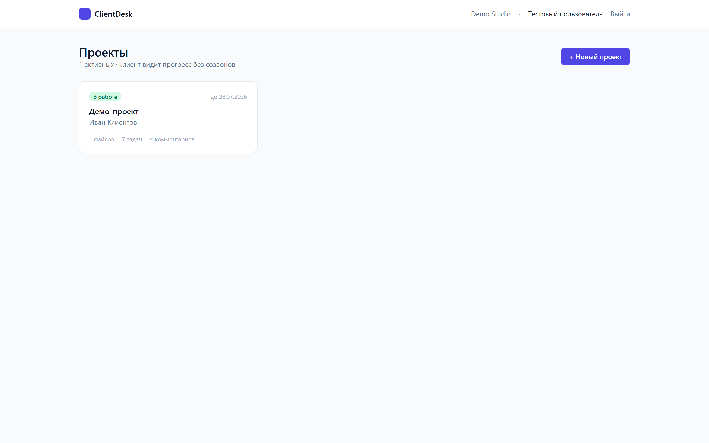
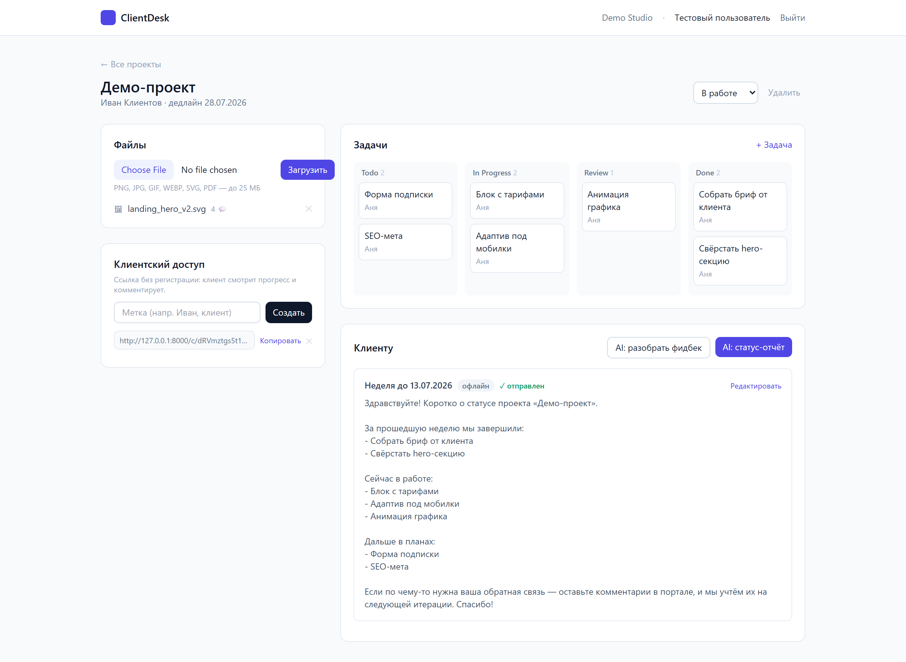
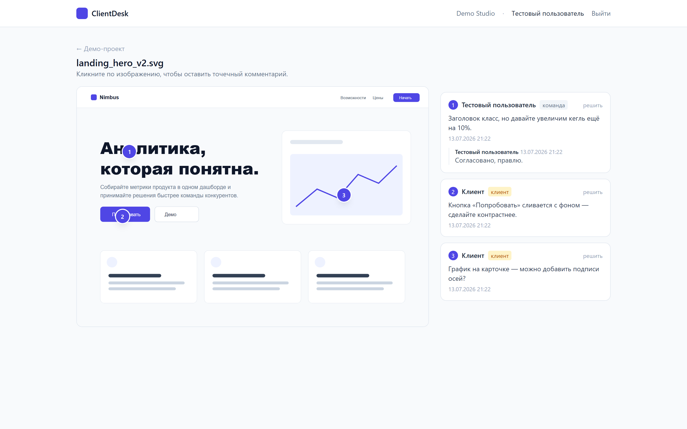
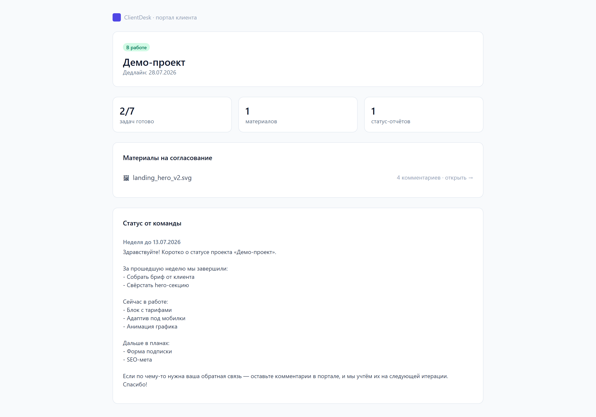
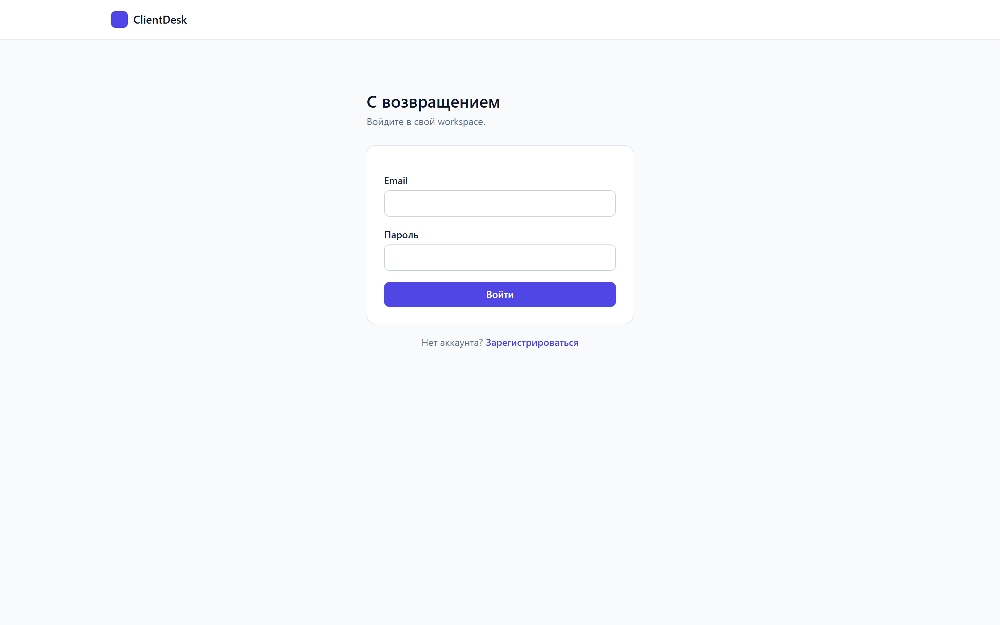

# ClientDesk (Django MVP)

AI-портал для фрилансеров и небольших агентств: проекты, файлы, **точечные комментарии
на макете**, Kanban-задачи, клиентский view по magic-link и **AI-статус-отчёты через Claude**.

Работающий локальный MVP по спецификации `project_clientdesk.md`, реализованный на **Django**
(фронт — Django-шаблоны + Tailwind/Alpine по CDN, бэк — Django views + ORM). Продакшн-стек
из спеки (Supabase, Cloud Run, Stripe, Resend, Sentry) заменён локальными аналогами, чтобы
приложение запускалось одной командой без внешних аккаунтов:

| В спецификации          | В этом MVP                                        |
|-------------------------|---------------------------------------------------|
| Supabase Postgres + RLS | SQLite + изоляция workspace на уровне запросов      |
| Supabase Auth           | `django.contrib.auth` (email = username) + Profile |
| Supabase Storage        | Локальная папка `uploads/` (FileResponse)          |
| Supabase Realtime       | Лёгкий polling комментариев на фронте               |
| Cloud Tasks / Scheduler | Синхронная генерация отчётов                         |
| Stripe / Resend / Sentry| Не подключены (заглушки)                             |
| **Claude API**          | **Реальный вызов**, если задан `ANTHROPIC_API_KEY`; иначе офлайн-фолбэк |

> История: первая версия MVP была на Flask (см. git-историю, коммит `12e9991`); затем
> переписана на Django по запросу.

## Как выглядит

**Дашборд проектов** — статусы, дедлайны, счётчики файлов/задач/комментариев:



**Страница проекта** — файлы, клиентская magic-link ссылка, Kanban и AI-статус-отчёт на одном экране:



**Точечные комментарии на макете** — клик по изображению ставит пронумерованный пин, справа треды команды и клиента:



**Клиентский портал по magic-link** — что видит клиент без регистрации: прогресс, материалы и статус-отчёты:



<details>
<summary>Экран входа</summary>



</details>

## Запуск

```bash
python -m venv .venv
# Windows PowerShell:
.venv\Scripts\Activate.ps1
# macOS/Linux:
# source .venv/bin/activate

pip install -r requirements.txt
cp .env.example .env            # опционально: впишите ANTHROPIC_API_KEY

python manage.py migrate
python manage.py runserver
```

Откройте http://127.0.0.1:8000 → зарегистрируйтесь → создайте проект.

## Как попробовать все фичи

1. **Проект** — создайте, укажите клиента и дедлайн.
2. **Файл** — загрузите изображение (PNG/JPG) на странице проекта.
3. **Точечные комментарии** — откройте файл, кликните по макету → пин с тредом.
   Координаты хранятся в процентах, поэтому корректны на любом экране.
4. **Kanban** — добавьте задачи и перетаскивайте карточки между колонками (drag-and-drop).
5. **Клиентский доступ** — создайте magic-link, откройте в приватном окне: клиент видит
   прогресс и комментирует без регистрации.
6. **AI-статус-отчёт** — «AI: статус-отчёт» собирает задачи в письмо клиенту → отредактируйте
   → «Отправить» → отчёт появится в клиентском портале.
7. **AI: разобрать фидбек** — группирует открытые комментарии клиента в actionable-чеклист.

Без `ANTHROPIC_API_KEY` пункты 6–7 работают в детерминированном офлайн-режиме.

## Структура

```
manage.py
clientdesk/          # проект Django: settings, urls, wsgi
core/
├── models.py        # workspace/profile, project, file, comment, task, link, report
├── views.py         # все представления + изоляция арендаторов
├── urls.py          # маршруты
├── ai.py            # Claude: статус-отчёт и summary фидбека (+офлайн-фолбэк)
├── context.py       # workspace текущего пользователя в шаблонах
├── admin.py         # админка Django
└── templatetags/    # фильтры для шаблонов
templates/           # base, auth, projects, file_view, client portal
```

Админка Django доступна на `/admin/` (создайте суперпользователя:
`python manage.py createsuperuser`).
